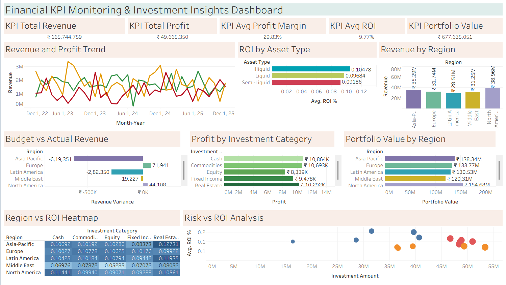

# 📊 Financial KPI Monitoring & Investment Insights Dashboard

> A professional Tableau dashboard for tracking financial KPIs and investment performance across regions, asset types, and investment categories — built to support data-driven strategic decision-making.

---

## 🖼️ Dashboard Preview



---

## 🎯 Objective

To design an interactive Tableau dashboard that monitors key financial KPIs — Revenue, Profit Margin, ROI, and Portfolio Value — and delivers investment performance insights across regions, asset classes, and investment categories, enabling finance teams and leadership to make informed strategic decisions.

---

## 🛠️ Tools & Technologies

| Tool | Purpose |
|------|---------|
| **Tableau Desktop / Public** | Dashboard creation & visualization |
| **GitHub** | Version control & project portfolio |
| **CSV** | Raw dataset format |

---

## 📁 Project Folder Structure

```
financial-kpi-investment-dashboard/
│
├── data/
│   └── financial_kpi_dataset.csv          # AI-generated dataset (600 rows, 20 columns)
│
├── tableau/
│   └── Financial KPI Monitoring & Investment Insights.twbx       # Packaged Tableau workbook
│
├── screenshots/
│   ├── Chart 1.png
│   ├── Chart 2.png
│   ├── Chart 3.png
│   ├── Chart 4.png
│   └── Chart 5.png
│   └── Chart 6.png
│   └── Chart 7.png
│   └── Chart 8.png
│   └── Chart 9.png
│   └── Chart 10.png
│   └── Dashboard.png
│
└── README.md
```

---

## 📂 Dataset Description

**File:** `data/financial_kpi_dataset.csv`  
**Rows:** 600 | **Columns:** 20 | **Period:** Jan 2023 – Dec 2025

| Column | Description |
|--------|-------------|
| Date, Month, Quarter, Year | Time dimensions |
| Investment Category | Cash, Commodities, Equity, Fixed Income, Real Estate |
| Investment Type | ETFs, T-Bills, Mutual Funds, REITs, Bonds |
| Region | Asia-Pacific, Europe, Latin America, Middle East, North America |
| Revenue / Expenses / Profit | Core financials |
| Profit Margin % | Profitability ratio |
| Investment Amount | Capital deployed |
| ROI % | Return on investment |
| Risk Level | High / Medium / Low |
| Asset Type | Illiquid / Liquid / Semi-Liquid |
| Portfolio Value | Total portfolio worth |
| Budgeted vs Actual Revenue | Budget tracking |
| Variance % | Budget deviation |
| Market Trend Indicator | Bullish / Bearish / Neutral |

---

## 📊 Dashboard Features

### KPI Cards (Top Row)
- 💰 **Total Revenue:** ₹16.57 Cr
- 📈 **Total Profit:** ₹4.97 Cr
- 📉 **Avg Profit Margin:** 29.83%
- 🔁 **Avg ROI:** 9.77%
- 🏦 **Portfolio Value:** ₹67.76 Cr

### Charts & Visualizations
1. **Revenue & Profit Trend** — Monthly line chart (2023–2025)
2. **ROI by Asset Type** — Horizontal bar chart
3. **Revenue by Region** — Column chart
4. **Budget vs Actual Revenue** — Variance bar chart by region
5. **Profit by Investment Category** — Bar chart
6. **Portfolio Value by Region** — Horizontal bar chart
7. **Region vs ROI Heatmap** — Cross-tab matrix
8. **Risk vs ROI Analysis** — Scatter plot
9. **Asset Type Distribution** — Pie/Donut chart
10. **Financial Detail Table** — Drill-down by Quarter, Category, Region, Risk Level, Year

### Interactive Filters
- Region | Investment Category | Asset Type | Risk Level | Year | Market Trend

---

## 🧮 Key Calculated Fields

```
Profit Margin %         = [Profit] / [Revenue]
ROI %                   = ([Revenue] - [Investment Amount]) / [Investment Amount]
Budget Variance %       = ([Actual Revenue] - [Budgeted Revenue]) / [Budgeted Revenue]
Portfolio Growth %      = ([Portfolio Value] - [Investment Amount]) / [Investment Amount]
High ROI Flag           = IF [ROI %] > AVG([ROI %]) THEN "High ROI" ELSE "Standard" END
Profitable Flag         = IF [Profit] > 0 THEN "Profitable" ELSE "Loss" END
```

---

## 🔍 Key Business Insights

1. **North America leads revenue** with ₹3.90 Cr (23.5% of total), followed closely by Asia-Pacific (₹3.53 Cr) — indicating mature, high-yield markets.

2. **Illiquid assets deliver the highest ROI (10.48%)** compared to Liquid (9.68%) and Semi-Liquid (9.19%) — suggesting long-term locked-in investments outperform in this portfolio.

3. **High-risk investments yield 12.97% avg ROI** vs 7.10% for low-risk — a classic risk-return trade-off validated across 600 data points.

4. **Cash and Real Estate lead profitability** with ₹1.09 Cr and ₹1.03 Cr profit respectively — defying the common perception that equities dominate.

5. **Revenue declined year-over-year**: ₹5.78 Cr (2023) → ₹5.49 Cr (2024) → ₹5.31 Cr (2025) — signaling the need for portfolio rebalancing.

6. **Asia-Pacific has a revenue budget deficit of ₹-6.19 Lakh** — the largest negative variance across all regions, requiring closer budget management.

7. **Bullish market conditions (38.5% of periods)** slightly outperform Bearish (25%) — confirming the macro market trend's influence on investment returns.

8. **Middle East shows the lowest ROI across most asset categories** — particularly Fixed Income (0.071) and Equity (0.053), indicating market inefficiencies or structural risk.

---

## 👤 Author

**Debarati Pal**  

